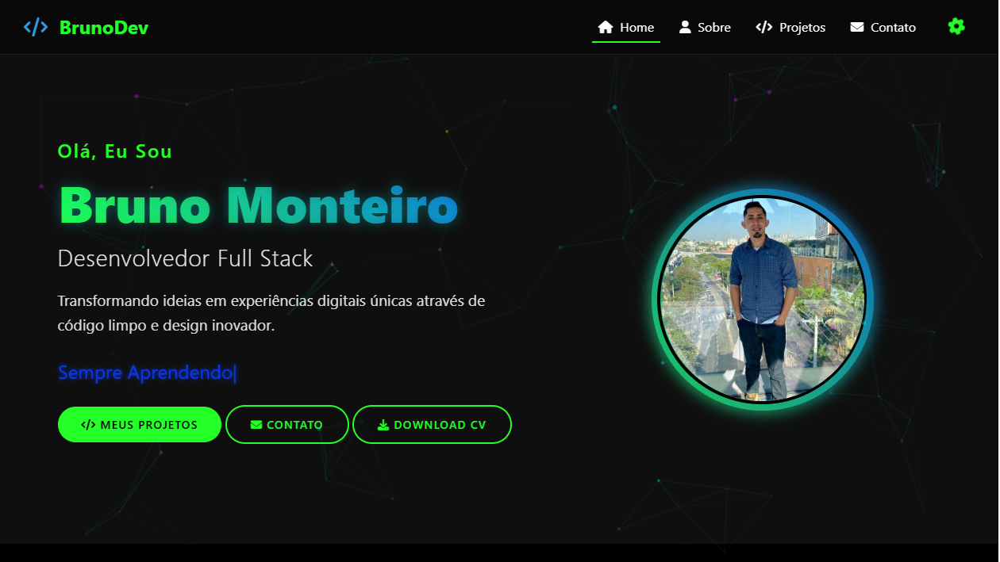

# Portfólio Profissional



Um portfólio profissional moderno e interativo, desenvolvido com tecnologias web modernas e design responsivo.

🌐 <a href="https://bruno-dev-portifolio.vercel.app" target="_blank">Ver Projeto Online</a>

## ✨ Features

- Design moderno com efeitos neon
- Interface totalmente responsiva
- Tema personalizável
- Animações suaves
- Efeito de partículas interativo
- Cards de projeto com efeito 3D
- Seção de habilidades dinâmica
- Download de currículo com notificação
- Modo dark theme
- Contato integrado

## 🚀 Tecnologias

- HTML5
- CSS3
- JavaScript
- Bootstrap 4
- AOS (Animate On Scroll)
- Particles.js
- Typed.js

## 📱 Responsividade

O projeto é totalmente responsivo e adaptável a diferentes tamanhos de tela:

- Desktop
- Tablet
- Dispositivos móveis

## ⚙️ Deploy

Este projeto está hospedado na [Vercel](https://vercel.com/):

- Deploy automático a partir do branch main
- SSL/HTTPS habilitado
- Performance otimizada
- CDN global

## ⚙️ Como Executar

1. Clone o repositório:

```bash
git clone https://github.com/Brunoxd23/Bruno-Dev-Portifolio.git
```

2. Abra o arquivo index.html em seu navegador ou use um servidor local como Live Server

## 🎨 Personalização

- O tema pode ser personalizado através do modal de configurações
- Cores primárias e secundárias ajustáveis
- Cor de fundo personalizável

## 📄 Licença

Este projeto está sob a licença MIT. Veja o arquivo [LICENSE](LICENSE) para mais detalhes.

## 📬 Contato

- Email: monteiro_100@outlook.pt
- LinkedIn: [Bruno Monteiro](https://www.linkedin.com/in/bruno-monteiro-52b174255/)
- GitHub: [Brunoxd23](https://github.com/Brunoxd23)
